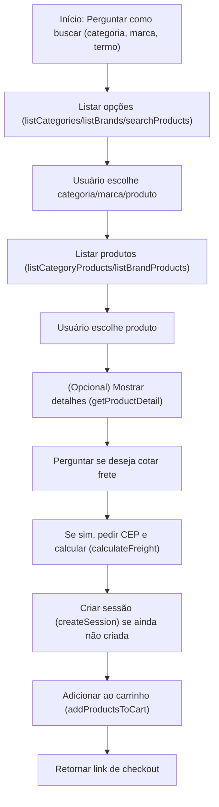

# Configurações MCP

## 1. Parâmetro obrigatório na URL

> **Atenção:**  
> Sempre que for se conectar ao MCP, é obrigatório passar o parâmetro `lojaUrl` na URL da requisição.  
> Exemplo de chamada:  
> ```
> POST https://mcp.uappi.com/mcp?lojaUrl=www.sandbox.uappi.dev.br
> ```
> O valor de `lojaUrl` deve ser uma URL válida do domínio da loja Uappi que será utilizada para todas as operações do fluxo de compra.

## 2. Menus obrigatórios na loja

> **Importante:**  
> Para que a listagem de categorias e marcas funcione corretamente no MCP, é necessário configurar **dois menus** na loja Uappi, cada um com a respectiva hash:
>
> - `categories-mcp` para o menu de categorias
> - `brands-mcp` para o menu de marcas
>
> Esses menus devem estar devidamente cadastrados na loja. O MCP utiliza essas hashs para buscar e exibir as categorias e marcas disponíveis para o usuário durante o fluxo de compra.

---

# Guia para Agente de IA – Fluxo de Compra Uappi

## 1. Fluxo Sugerido de Compra

Este é um fluxo sugerido para auxiliar o usuário na jornada de compra. O agente de IA deve seguir este roteiro, adaptando conforme as respostas e escolhas do usuário, sempre utilizando os dados reais retornados pelas ferramentas (tools) do MCP.

1. **Início:**  
   Pergunte ao usuário como ele deseja buscar produtos:
   - Por categoria
   - Por marca
   - Por termo de busca

2. **Listagem Inicial:**
   - Se o usuário escolher **categoria**, utilize a tool `listCategories` e mostre as opções.
   - Se escolher **marca**, utilize a tool `listBrands` e mostre as opções.
   - Se quiser buscar por termo, utilize a tool `searchProducts` com o termo fornecido.

3. **Seleção de Produtos:**
   - Se o usuário escolher uma categoria, utilize `listCategoryProducts` com a **rota** da categoria escolhida.
   - Se escolher uma marca, utilize `listBrandProducts` com a **rota** da marca escolhida.
   - Se buscou por termo, mostre os produtos retornados.

4. **Detalhes do Produto (Opcional):**
   - Se o usuário quiser mais detalhes de um produto, utilize `getProductDetail` com a **rota** do produto.

5. **Cotação de Frete:**
   - Pergunte se o usuário deseja cotar o frete.
   - Se sim, solicite o CEP e utilize a tool `calculateFreight` com o CEP e os **dados reais do(s) produto(s)** escolhido(s): IDs de produto, IDs de atributo, preço e quantidade.

6. **Adicionar ao Carrinho e Gerar Link de Checkout:**
   - Antes de adicionar ao carrinho, **crie uma sessão** usando `createSession` (faça isso apenas uma vez por fluxo!).
   - Utilize `addProductsToCart` com o `sessionId` e os itens escolhidos (**usando sempre os IDs e atributos reais dos produtos**).
   - **Nunca invente, chute ou gere IDs de produto ou atributo! Sempre utilize exatamente os valores retornados pelas tools anteriores.**
   - Retorne o link de checkout para o usuário.

---

## 2. Regras Importantes

- **Nunca crie mais de uma sessão por fluxo de compra!**  
  Use a tool `createSession` apenas uma vez e reutilize o `sessionId` nas próximas operações.

- **Sempre utilize os dados reais retornados pelas tools anteriores.**  
  **Nunca invente, chute ou gere manualmente rotas, IDs de produto, IDs de atributo ou outros dados.**
  - A propriedade `rota` (route) de categorias, marcas e produtos deve SEMPRE ser obtida diretamente das respostas das tools de listagem (`listCategories`, `listBrands`, `searchProducts`, `listCategoryProducts`, `listBrandProducts`).
  - O campo `idProduto` (ID do produto) e os campos de atributos (`idAtributoSimples`, `idAtributoValor`, etc.) devem SEMPRE ser obtidos dos objetos de produto retornados pelas tools de busca ou detalhe de produto.
  - O campo `preco` (preço) também deve ser obtido do produto selecionado.
  - **IDs aleatórios, fictícios ou inventados podem causar erros graves no fluxo!**
  - Não pule etapas (ex: não tente adicionar ao carrinho sem criar sessão ou sem o produto escolhido).

---

## 3. Exemplos de Uso das Tools

### Buscar produtos por termo
- **Tool:** `searchProducts`
- **Requisição:**
  `{ "query": "notebook" }`
- **Resposta:**
  `{ "products": [ { "idProduto": 1, "nome": "Notebook Dell", "rota": "/notebook-dell-123.html", ... } ] }`
  - **Pegue o campo `rota` do produto para usar em `getProductDetail` ou para adicionar ao carrinho.**
  - **Pegue o campo `idProduto` do produto para usar em operações de carrinho e frete.**

### Listar categorias
- **Tool:** `listCategories`
- **Requisição:**
  `{ }`
- **Resposta:**
  `{ "categories": [ { "nome": "Informática", "rota": "/informatica" }, ... ] }`
  - **Pegue o campo `rota` da categoria para usar em `listCategoryProducts`.**

### Listar marcas
- **Tool:** `listBrands`
- **Requisição:**
  `{ }`
- **Resposta:**
  `{ "brands": [ { "nome": "Dell", "rota": "/dell" }, ... ] }`
  - **Pegue o campo `rota` da marca para usar em `listBrandProducts`.**

### Listar produtos de uma categoria
- **Tool:** `listCategoryProducts`
- **Requisição:**
  `{ "route": "/informatica" }`
- **Resposta:**
  `{ "products": [ { "idProduto": 1, "nome": "Notebook Dell", "rota": "/notebook-dell-123.html", ... } ] }`
  - **Pegue o campo `rota` do produto para usar em `getProductDetail` ou para adicionar ao carrinho.**
  - **Pegue o campo `idProduto` do produto para usar em operações de carrinho e frete.**

### Listar produtos de uma marca
- **Tool:** `listBrandProducts`
- **Requisição:**
  `{ "route": "/dell" }`
- **Resposta:**
  `{ "products": [ { "idProduto": 1, "nome": "Notebook Dell", "rota": "/notebook-dell-123.html", ... } ] }`
  - **Pegue o campo `rota` do produto para usar em `getProductDetail` ou para adicionar ao carrinho.**
  - **Pegue o campo `idProduto` do produto para usar em operações de carrinho e frete.**

### Obter detalhes de um produto
- **Tool:** `getProductDetail`
- **Requisição:**
  `{ "route": "/notebook-dell-123.html" }`
- **Resposta:**
  `{ "detail": { "idProduto": 1, "sku": "123", "nome": "Notebook Dell", "atributos": [ { "tipo": "simples", "valores": [ { "idAtributoValor": 456, ... } ] } ], ... } }`
  - **Pegue o campo `idProduto` do produto para usar em operações de carrinho e frete.**
  - **Pegue o campo `idAtributoValor` dos atributos, se necessário, para operações de frete e carrinho.**

### Criar sessão de carrinho
- **Tool:** `createSession`
- **Requisição:**
  `{ }`
- **Resposta:**
  `{ "session": { "sessionId": "abc123" } }`
  - **Guarde o `sessionId` para todas as operações seguintes de carrinho.**

### Adicionar produtos ao carrinho
- **Tool:** `addProductsToCart`
- **Requisição:**
  ```json
  {
    "sessionId": "abc123",
    "itens": [
      {
        "idProduto": 213, // Pegue do campo `idProduto` do produto retornado pela listagem ou detalhe
        "idAtributoSimples": 0, // Pegue do atributo do produto, se necessário
        "quantidade": 2
      }
    ]
  }
  ```
  - **Nunca invente, chute ou gere IDs! Sempre use exatamente os IDs retornados pelas tools anteriores.**
- **Resposta:**
  `{ "checkoutUrl": "https://www.sandbox.uappi.dev.br/checkout/recuperacao?sessao=abc123" }`

### Calcular frete
- **Tool:** `calculateFreight`
- **Requisição:**
  ```json
  {
    "cep": "12345678",
    "itens": [
      {
        "idProduto": 123, // Pegue do campo `idProduto` do produto
        "idAtributoValor": 456, // Pegue do atributo do produto
        "preco": 99.90, // Pegue do campo `preco` do produto
        "quantidade": 1
      }
    ]
  }
  ```
- **Resposta:**
  `{ "frete": { "entregas": [ { "cotacoes": [ { "label": "PAC", "valor": 20.00 } ] } ], "itensIndisponiveis": [] } }`

---

## 4. Resumo do Fluxo Sugerido



---

## 5. Configuração do MCP no n8n

Para integrar o MCP ao **n8n**, é necessário seguir as instruções abaixo e garantir que o ambiente está utilizando as versões compatíveis:

### ✅ Requisitos mínimos

- **n8n versão `>= 1.104.0`**
  - Versões anteriores **não suportam** o transporte necessário para comunicação com o MCP.
- **Transporte HTTP:**  
  - O n8n deve estar configurado com o **Server Transport `HTTP Streamable`**, que permite suporte completo à comunicação com ferramentas como o MCP Client.
- **MCP Client Tool:**
  - Utilize o **nó do MCP com versão `>= 1.1`** para garantir compatibilidade com as últimas funcionalidades e correções.
  - Este nó é normalmente identificado como `MCP Client Tool` ou similar, dependendo da instalação e do ambiente.

### ⚙️ Configuração no fluxo do n8n

1. **Adicione o nó do tipo `MCP Client Tool`** ao seu fluxo.
2. **Configure a URL de destino**, incluindo o parâmetro `lojaUrl` obrigatoriamente:
   ```
   https://mcp.uappi.com/mcp?lojaUrl=www.sandbox.uappi.dev.br
   ```
3. **Selecione a ação desejada** (por exemplo: `listCategories`, `searchProducts`, etc).
4. **Preencha os campos com os parâmetros esperados** de acordo com o exemplo de uso das tools já descritos anteriormente neste documento.
5. **Utilize o output do nó** para seguir o fluxo de compra conforme o roteiro do agente de IA.

---

## 6. Dicas Finais

- Sempre explique ao usuário o próximo passo.
- Nunca faça requisições desnecessárias.
- Se não houver resultados, informe claramente ao usuário.
- Se ocorrer erro, explique o motivo e oriente o usuário. 
- **Nunca invente IDs, rotas ou atributos!**
